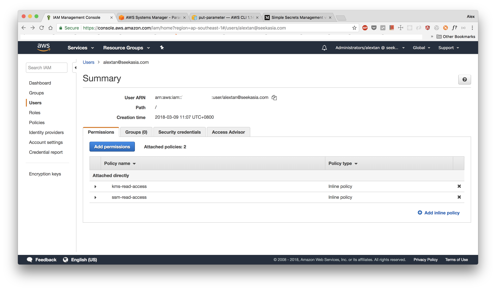
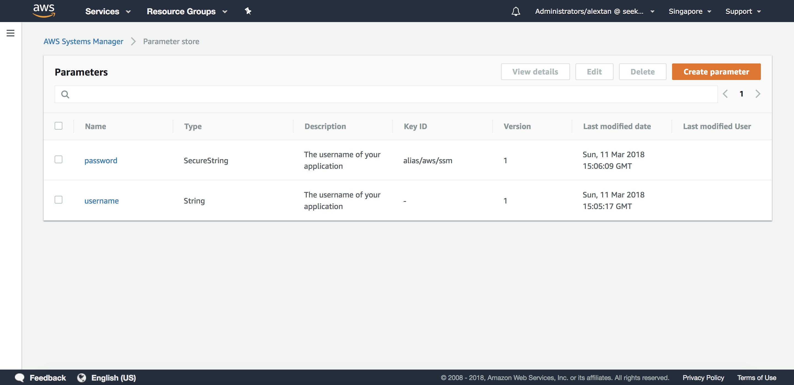

# AWS Parameter Store

Use Parameter store to centralize all your configurations and sensitive keys. With Parameter Store you can:

- secure your application
- handle all your applications configuration in a centralized place
- dynamic config, any changes can be reflected real-time in your application
- no more sending sensitive credentials through Slack/Email (very bad practice)
- easy integration as AWS SDK is available for multiple clients

## IAM Policy

Create two inline policy, `kms-read-access`:

```json
{
    "Version": "2012-10-17",
    "Statement": [
        {
            "Sid": "VisualEditor0",
            "Effect": "Allow",
            "Action": [
                "kms:Decrypt",
                "kms:DescribeKey"
            ],
            "Resource": "arn:aws:kms:ap-southeast-1:<YOUR_ACCOUNT_ID>:key/*"
        }
    ]
}
```

and `ssm-read-access`. It is a *good practice* to limit the resource to the key-value that you want to access:

```json
{
    "Version": "2012-10-17",
    "Statement": [
        {
            "Sid": "VisualEditor0",
            "Effect": "Allow",
            "Action": [
                "ssm:Get*",
                "ssm:Put*"
            ],
            "Resource": [
              "arn:aws:ssm:ap-southeast-1:<YOUR_ACCOUNT_ID>:parameter/username",
              "arn:aws:ssm:ap-southeast-1:<YOUR_ACCOUNT_ID>:parameter/password"
            ]
        },
        {
            "Sid": "VisualEditor1",
            "Effect": "Allow",
            "Action": "ssm:DescribeParameters",
            "Resource": "*"
        }
    ]
}
```

Output:



## Creating String Value

Creating an insecure name, e.g. `db_username`:

```bash
$ aws ssm put-parameter --name username --value admin --description "The username of your application" --type String
```

Creating a secure name, e.g. `db_password`:

```bash
$ aws ssm put-parameter --name password --value admin --description "The password of your application" --type SecureString --key-id alias/aws/ssm
```

Output:



## Getting Encrypted Values

```bash
$ aws ssm get-parameters --names username password
```

Output:

```json
{
    "InvalidParameters": [],
    "Parameters": [
        {
            "Type": "SecureString",
            "Name": "password",
            "Value": "AQICAHiZLv5ybto0IW1pztY7jamSw4vIhzu4alJDALZjLZdmLgF7h61JVVpWsbFGEws7CPF3AAAAYzBhBgkqhkiG9w0BBwagVDBSAgEAME0GCSqGSIb3DQEHATAeBglghkgBZQMEAS4wEQQMWLItsYr0TChRE/8TAgEQgCCA7RMcwta3ELvl1Y+qf3cHkffW383491WZQT8jrRLM+Q=="
        },
        {
            "Type": "String",
            "Name": "username",
            "Value": "admin"
        }
    ]
}
```

## Getting Decrypted Values

```bash
$ aws ssm get-parameters --with-decryption --names username password
```

Output:

```json
{
    "InvalidParameters": [],
    "Parameters": [
        {
            "Type": "SecureString",
            "Name": "password",
            "Value": "admin"
        },
        {
            "Type": "String",
            "Name": "username",
            "Value": "admin"
        }
    ]
}
```
